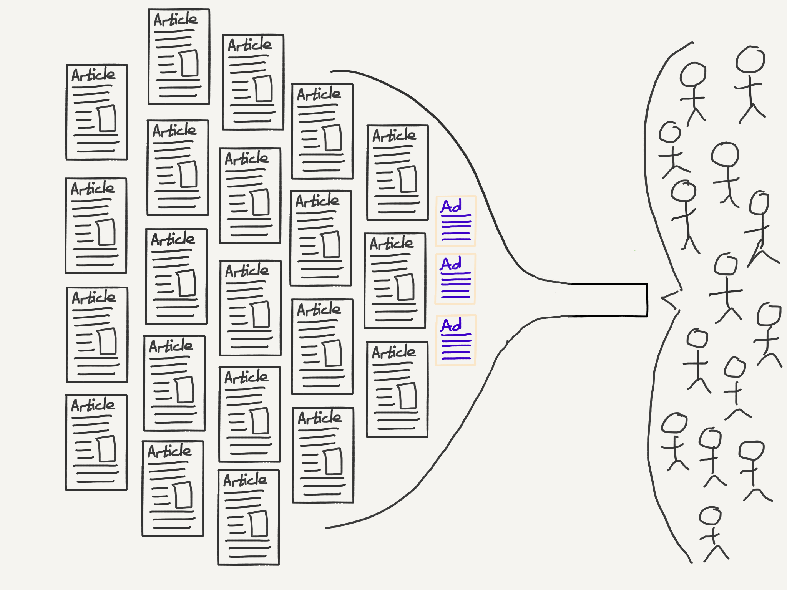

+++
slug = "art-of-profitability"
date = 2020-11-19
visibility = "draft"
bib_paths = ["/ref.bib"]
+++

# Notes on *The Art of Profitability*

*The Art of Profitability* is a tour through the mentorship of an accountant in
ho-hum telecom firm as he learns different models for business profitability
from his eccentric mentor Zhao. [^@slywotzky2002art] 

### 1. Customer solutions profit

The case study compares two companies selling financial information. The better
company assigns two workers to embed in the company for several months to learn
the customer business entirely.

> Invest time and energy in learning all there is to know about your customers.
> Then use that knowledge to create specific solutions for *them*. Lose money
> for a short time. Make money for a long time.

### 2. Pyramid profit

The case study highlights Mattel's pyramid of Barbie dolls. The cheap $10 Barbie
dolls form the lower steps and the $200 Barbie dolls adorn the top.

> A true pyramid is a system in which the lower-priced products are 
> manufactured and sold with so much efficiency that it's virtually impossible
> for a competitor to steal market share by underpricing you.

### 3. Multi-component profit

The price sensitivity of a customer depends on their context. A customer at a
restaurant is willing to pay 20 cents per ounce of Coke. In a grocery store, the
same customer is only willing to pay 2 cents per ounce. Multi-component profit
views a business as a series of price-differentiated components with wildly
different profitability.

CAPTION: The model of a business divided into multiple components where each
component targets similar customers at different price points.

The chapter ends with a warning from Zhao about the telecom business focus on 
well-made, inexpensive telecom equipment instead of focusing on the first profit 
model, customer solutions profit: "It's very hard to keep making money, let 
alone grow, once you've allowed yourself to be boxed into a no-profit zone."

As a real-world example, the CEO of Drop (formerly Massdrop), explains how their
largest revenue business component, selling third-party products for a discount.
The decision to shut down the third-party sales was especially difficult because
all of the key performance indicators were outstanding. The long-term trouble
was that the unit economics was awful and the profit margin hadn't improved in
the years since introducing the third-party product business component. The CEO,
Steve El-Hage, said: "Our long-term value prop for the third-party products was
built on price, which is very fragile and fleeting value prop."
[^@first2020founder]

Interestingly, El-Hage's analysis matches the fictional mentor's analysis of the
flailing telecom company. Zhao warned that "it's remarkable how quickly a
structure can crumble once cracks appear in the foundation." Both Zhao and
El-Hage warn against competing in low-margin businesses where competition
quickly devolves into a race to the bottom. El-Hage instead focused the company
on building high-quality boutique products by partnering a vibrant community
directly with manufacturers.

### 4. Switchboard profit

The assigned reading for the chapter was [Obvious Adams], a short novel by 
Robert Updegraff published in 1916. The novel is short and an enjoyable read 
with vibrant metaphors. [^margin:metaphor] The main character is a ordinary boy 
bestowed with a keen sense of obvious solutions and the resolution to accomplish 
the task. The key point, summarized by the protagonist, Obvious Adams:

[Obvious Adams]: obvious-adams.pdf

> Picking out the obvious thing presupposes analysis, and analysis presupposes
> thinking, and I guess [Professor Zueblin] is right when he says thinking is 
> the hardest work many people ever have to do.

:::footnote margin:metaphor
My favorite metaphor from the book, describing Obvious Adams' skill with ad 
copy:

> He has transformed trade names into dictionary nouns.
:::

[Professor Zueblin]: https://en.wikipedia.org/wiki/Charles_Zueblin

Our fearless mentor, Zhao, illustrates the switchboard model through the famed
Hollywood agent turned Disney President, [Michael Ovitz]. Ovitz created packages
of start actors, screen writers, a directory, and supporting actors and sold
them to studios. The genius in Ovitz's play was to add two additional
ingredients, First, enrich the package by sourcing compelling stories from
literary clubs. Second, represent enough actors to reach a critical mass so that
studios *need* to work with you to get talent. As Ovitz reached critical mass,
likely around 15-20%, people perceive the percentage to be much higher which
means actors will seek his representation. At critical mass, Ovitz has much
greater bargaining power because he represents a significant share of the market
and is selling an entire package. Additionally, he can work a higher volume of
deals. In total, his revenue per unit time increases 10x.

[Michael Ovitz]: https://en.wikipedia.org/wiki/Michael_Ovitz

::: preview https://en.wikipedia.org/wiki/Charles_Zueblin
Charles Zueblin

Charles Zueblin (1866-1924) was an American sociologist. In 1891, Zueblin 
founded the Northwestern University Settlement. In 1892, he became the 
first secretary of the Chicago Society for University Extension. From 1892 to 
1895 he was instructor; from 1895 to 1896 assistant professor; from 1896 to 1902
associate professor; and from 1902 to 1908 full professor of sociology at the 
University of Chicago. From 1911 to 1912, he was editor of the 20th Century 
Magazine.

Zueblin lectured extensively and contributed frequently to philosophical and 
sociological journals, and to many of the most prominent magazines and reviews.
From 1901 to 1902, he was president of the American League for Civic 
Improvement; in 1904, the organization would become the American Civic 
Association.
:::

::: preview https://en.wikipedia.org/wiki/Michael_Ovitz
Michael Ovitz

Michael Steven Ovitz (born December 14, 1946) is an American businessman,
investor, and philanthropist. He was a talent agent who co-founded Creative
Artists Agency (CAA) in 1975 and served as its chairman until 1995. Ovitz later
served as President of The Walt Disney Company from October 1995 to
January 1997. 
:::

CAPTION: The switchboard is the middle broker connecting two sides of a market.
After achieving critical mass, both side *must* use the broker.

Ben Thompson, of Stratechery fame, classifies this profit mode as an
*aggregator* model. An aggregator attracts "end users by virtue of their
inherent usefulness and, over time, leave suppliers no choice but to follow the
aggregators' dictates if they wish to reach end users." Since the critical
differentiation between aggregators is the number of users on their platform,
the platform must be free for users, so advertising is the only available model.

CAPTION: The Stratechery aggregator model showing the aggregator granting access
to a large pool of users.

