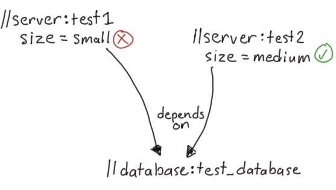
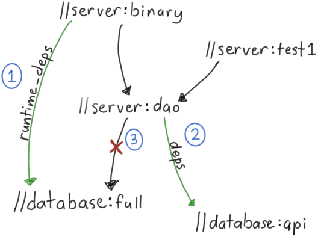

+++
slug = "advanced-queries-bazel"
date = 2019-02-26
visibility = "published"
+++

# [Advanced queries with Bazel](/advanced-queries-bazel/)

I often need to query complex things with [Bazel](https://www.bazel.build/), an
open-source build system from Google that focuses on performance and correctness
by enforcing hermetic builds. For a more complete list of examples, see the
official
[Bazel query how-to](https://docs.bazel.build/versions/master/query-how-to.html).

## Find all tests marked as `size = small` that have a database dependency

Google tests have a specific
[size](https://testing.googleblog.com/2010/12/test-sizes.html) (small, medium,
large) with strict time-outs. If a small test exceeds 60 seconds, the test
fails. For tests involving a database, the tests need to be marked as medium to
avoid flaky timeouts.

```bash
bazel query '
  attr(size, small, //server/...:all)
  intersect
  rdeps(//server/...:all,
        //database:test_database)'
```



CAPTION: Dependency graph of tests on the test database with the size attribute.

CONTINUE READING

For additional convenience, we can pipe this through
[buildozer](https://github.com/bazelbuild/buildtools/blob/master/buildozer/README.md),
a command line tool to update BUILD files, to update the size attribute for us.

```bash
bazel query '<same as above>' |
  xargs -I {} buildozer 'set size medium' {}
```

## Find all binaries that have a dependency on a specific target

There are two BUILD labels for our database:

- the `full` label for binaries included in `runtime_deps`
- the `api` label for library and test code

Our database library incorrectly had the `full` target in the `deps` attribute
which meant all of the tests needlessly included the full database. Removing the
`full` target from `//server:dao` requires three steps:



CAPTION: Dependency graph of the server binary, the DAO library and database
libraries.

1.  Add `//database:full` to the `runtime_deps` of each binary that has a
    transitive dependency on the full target. This is a no-op if the runtime
    dependency already exists.

    ```bash
    # Finds all java binaries that depend on full target
    # with a max distance of 10 edges and adds a
    # runtime_dependency.
    blaze query '
      kind("java_binary", allrdeps(//database:full, 10))' |
      xargs -I {} \
        buildozer 'add runtime_deps //database:full' {}
    ```

2.  Add `//database:api` to the `deps` of `//server:dao`.

    ```bash
    buildozer 'add deps //database:api //server:dao'
    ```

3.  Remove `//database:full` from the `deps` of `//server:dao`.

    ```bash
    buildozer 'remove deps //database:full //server:dao'
    ```
