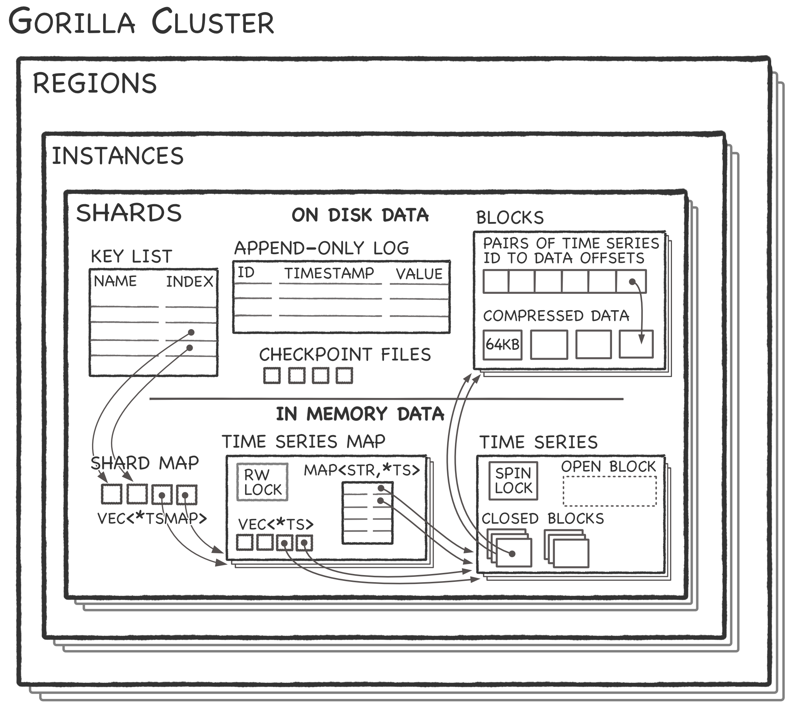
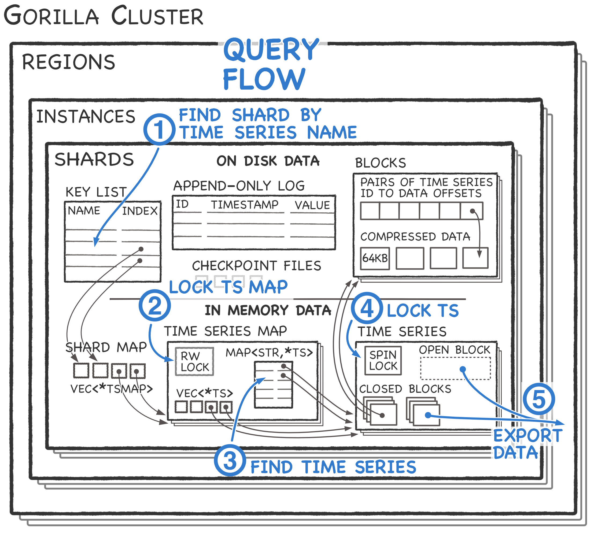
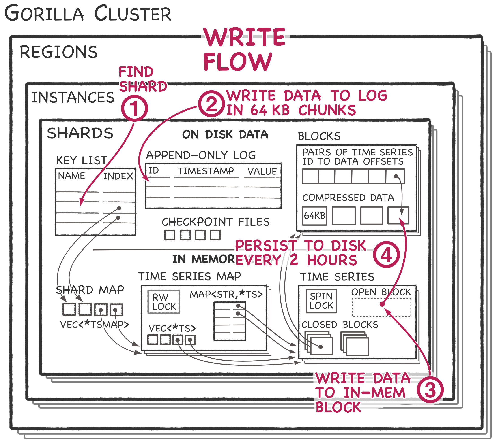

+++
slug = "gorilla-time-series-database"
date = 2020-03-22
visibility = "published"
+++

# Gorilla Time Series Database

Gorilla is an in-memory, time series database from Facebook optimized for
writes, reading data in a few milliseconds, and high availability. Facebook
open-sourced the code as [Beringei], but the repo is archived. At its core,
Gorilla is a 26-hour write-through cache backed by durable storage in [HBase], a
distributed key-value store. Gorilla’s contributions include a novel, streaming
timestamp compression scheme.

Paper: [Gorilla: A Fast, Scalable, In-Memory Time Series Database][gorilla]

[gorilla]: gorilla.pdf
[hbase]: https://hbase.apache.org/
[beringei]: https://github.com/facebookarchive/beringei



CAPTION: The architecture of a Gorilla cluster. A cluster runs in 2 regions.
Each region contains multiple instances. Each instance contains shards that
store time series data.

CONTINUE_READING

Gorilla optimizes for four attributes:

1. High data insertion rate. The primary requirement is that Gorilla should
   always be available to take writes. The expected insertion rate is 10M data
   points per second. Each data point consists of a 64 bit timestamp with a 64
   bit float value.

2. Real-time monitoring to show new data within tens of seconds.

3. Read latency in less than millisecond and fast scans over all in-memory data
   in tens of milliseconds.

4. Reliability requirements. Gorilla always serves reads even if a server
   crashes or when an entire region fails.

Gorilla compromises on the following attributes:

- Flexibility. The only supported data type is a named stream of 64 bit floating
  point values. Higher level abstractions can be built on top of Gorilla.
- Duration. Gorilla only stores the last 26 hours of data.
- Granularity. The minimum granularity is 15 seconds.
- Durability. A server crash can cause data loss of up to 64kB which is 1-2
  seconds of data. During prolonged outages, Gorilla preserves the most recent 1
  minute of data and discards the rest of the data.
- Consistency. Data is streamed between datacenter regions without attempting to
  guarantee consistency.
- Query flexibility. Gorilla serves raw compressed blocks to clients. There’s no
  query engine in Gorilla so clients are expected to process the compressed
  blocks.

# Time stamp compression

Gorilla introduces a novel lossless compression scheme for streaming timestamps.
Gorilla’s timestamp encoding is based on the observation that the vast majority
of timestamps arrive at a fixed interval. A fixed interval is common if metrics
are pulled from servers at regular intervals, like every 30 seconds. Using
sampled production data, the Gorilla team found 96% of timestamps compress to a
single bit with the compression scheme.

To implement the compression, each stream is divided into blocks aligned at
two-hour intervals. The block header contains a 64 bit timestamp of the
beginning of the block, e.g. `2019-09-05T02:00`. The first timestamp is the
delta from the header timestamp stored in 14 bits. Using 14 bits allows one
second granularity within the two hour window. Subsequent timestamps are encoded
with a double delta scheme as shown below:

```
# Block timestamp aligned to 8:00:00.
timestamps =    [8:00:30, 8:01:30, 8:02:30, 8:03:28]
deltas =        [     30,      60,      60,      57]
double_deltas = [       ,      30,       0,      -3]
```

The `double_deltas` are encoded using a variable sized integer encoding similar
to the [varint encoding] in Protocol Buffers described below:

[varint encoding]:
  https://developers.google.com/protocol-buffers/docs/encoding#varints

The `delta_deltas` are encoded using a variable sized integer encoding.

- If the delta is zero, store a single `0` bit.
- If the delta is in `[-64, 64)` store `0b10` followed by the signed value in 7
  bits.
- If the delta is in `[-256, 256)` store `0b110` followed by the signed value in
  9 bits.
- If the delta is in `[-2048, 2048)` store `0b1110` followed by the signed value
  in 12 bits.
- Otherwise, store `0b1111` followed by the delta in 32 bits.

The 4 timestamps would be encoded as follows:

```text
Block header: Timestamp at 08:00:00 in 64 bits.

# Encode the first value as a delta from the block header (not double delta)
# Use 14 bits to allow 1 second precision in a 2 hour block.
binary(30) in 14 bits

# Encode the second value using the double delta varint scheme above. The double
# delta is in the range [-64, 64), so use 0b10 followed by 7 bits of the
# signed value.
0b10 + binary(30) in 7 bits

# Encode the third value using the double delta scheme. The value is 0,
# so use a single 0 bit.
0

# Encode the fourth value using the double delta scheme. The double delta, -3,
# is in the range [-64, 64).
0b10 + binary(-3)
```

# Time series value compression

Gorilla uses xor compression for the floating point values associated with a
timestamp. Using xor on similar float values drops the sign, exponent, and first
few bits of the mantissa from the floating point value. This compression scheme
takes advantage of the fact that most values don’t change significantly compared
to neighboring values. The Gorilla team found that 59% of values are identical
to the previous value and compress to a single `0` bit. Since the encoding is
variable length, the entire two hour block must be decoded to access values.
This isn’t a problem for time series databases because the value of the data
lies in aggregation, not in single points.

# Architecture


CAPTION: The architecture of a Gorilla cluster. The compressed time series data
are stored in blocks associated with a shard..

Gorilla runs instances in two redundant regions. Both regions consist of many
instances. Each instance contains a number of shards. Each shard contains many
named time series. Time series data in blocks and in the append-only log is
persisted on a distributed file system for durability. Gorilla instances
replicate shard data to the corresponding shard in the other region but make no
attempt to maintain consistency between shards in each region.

A Paxos-based system called ShardManager assigns shards to nodes. I think each
time series is contained by a single shard. It’s unclear if Gorilla mitigates
hotspots that might occur for frequent metrics. The in-memory organization of
Gorilla is a two-level map:

1. The time series map is the first level map from a shard index to a time
   series map. The key list contains the mapping between a time series name and
   its shard index.
2. The time series map maps a string name to a `TimeSeries` data structure.
   Additionally, time series map maintains a vector of the same `TimeSeries`
   data structures for efficient scans over the entire dataset.
3. The `TimeSeries` data structures consists of an open block for incoming
   writes and two-hour closed blocks for the previous 26 hours.

## Query flow



CAPTION: How a query is processed by a Gorilla instance

The `TimeSeries` data structure is a collection of closed blocks containing
historical data and a single open block containing the previous two hours of
data. Upon receiving a query:

1. The Gorilla node checks the key list to get the index of the shard containing
   the named time series. Gorilla uses the index in the shard map to get the
   pointer to time series map.
2. Gorilla read locks the time series map to prevent race conditions.
3. Using the map, Gorilla looks up and copies the pointer to the time series and
   then releases the read lock.
4. Gorilla spin locks the time series to avoid mutation while data is copied.
   Finally, Gorilla copies the data as it exists to the outgoing RPC. Notably,
   Gorilla sends the compressed form of data to clients. Gorilla expects clients
   to decompress the compressed data.

## Write flow



CAPTION: How a query is processed by a Gorilla instance.

1. First, Gorilla looks up the shard ID to get the directory containing the
   append-only log for the data.
2. Gorilla appends the data to a shard-specific log. The log is not a write
   ahead log. Gorilla only writes data once it has 64kb of data for the shard
   which is 1-2 seconds of data. The log must include a 32bit integer ID to
   identify the named timestamp which increases the data size dramatically
   compared to the compression scheme within a `TimeSeries` data structure.
3. Similarly to the query flow, Gorilla uses the shard map and time series map
   to find the correct time series data structure. Gorilla appends the data to
   the open block in the time series data structure using the compression
   algorithm described above.
4. After two hours, the Gorilla node closes all open blocks and flushes each one
   to disk with a corresponding checkpoint file. After all `TimeSeries` data
   structures for a shard are flushed, the Gorilla node deletes the append-only
   log for that shard.
   
::: preview gorilla.pdf   
Gorilla: A Fast, Scalable, In-Memory Time Series Database

Large-scale internet services aim to remain highly available and responsive in
the presence of unexpected failures. Providing this service often requires
monitoring and analyzing tens of millions of measurements per second across a
large number of systems, and one particularly effective solution is to store and
query such measurements in a time series database (TSDB).

A key challenge in the design of TSDBs is how to strike the right balance
between efficiency, scalability, and reliability. In this paper we introduce
Gorilla, Facebook’s inmemory TSDB. Our insight is that users of monitoring
systems do not place much emphasis on individual data points but rather on
aggregate analysis, and recent data points are of much higher value than older
points to quickly detect and diagnose the root cause of an ongoing problem.
Gorilla optimizes for remaining highly available for writes and reads, even in
the face of failures, at the expense of possibly dropping small amounts of data
on the write path.

To improve query efficiency, we aggressively leverage compression techniques
such as delta-of-delta timestamps and XOR’d floating point values to reduce
Gorilla’s storage footprint by 10x. This allows us to store Gorilla’s data in
memory, reducing query latency by 73x and improving query throughput by 14x when
compared to a traditional database (HBase)- backed time series data. This
performance improvement has unlocked new monitoring and debugging tools, such as
time series correlation search and more dense visualization tools.
:::

::: preview https://github.com/facebookarchive/beringei
Beringei is a high performance, in-memory storage engine for time series data.

This repo has been archived and is no longer being actively maintained. 

A high performance, in memory time series storage engine. In the fall of 2015,
we published the paper “Gorilla: A Fast, Scalable, In-Memory Time Series
Database” at VLDB 2015. Beringei is the open source representation of the ideas
presented in this paper.
                                                          
Beringei is a high performance time series storage engine. Time series are
commonly used as a representation of statistics, gauges, and counters for
monitoring performance and health of a system.
:::

::: preview https://hbase.apache.org/
Apache HBase

Apache HBase is the [Hadoop] database, a distributed, scalable, big data store.

[Hadoop]: https://hadoop.apache.org/

Use Apache HBase™when you need random, realtime read/write access to your Big
Data. This project's goal is the hosting of very large tables -- billions of
rows X millions of columns -- atop clusters of commodity hardware. Apache HBase
is an open-source, distributed, versioned, non-relational database modeled after
Google's [Bigtable: A Distributed Storage System for Structured Data][bigtable] by Chang et
al. Just as Bigtable leverages the distributed data storage provided by the
Google File System, Apache HBase provides Bigtable-like capabilities on top of
Hadoop and HDFS.

[bigtable]: https://research.google.com/archive/bigtable.html
:::
