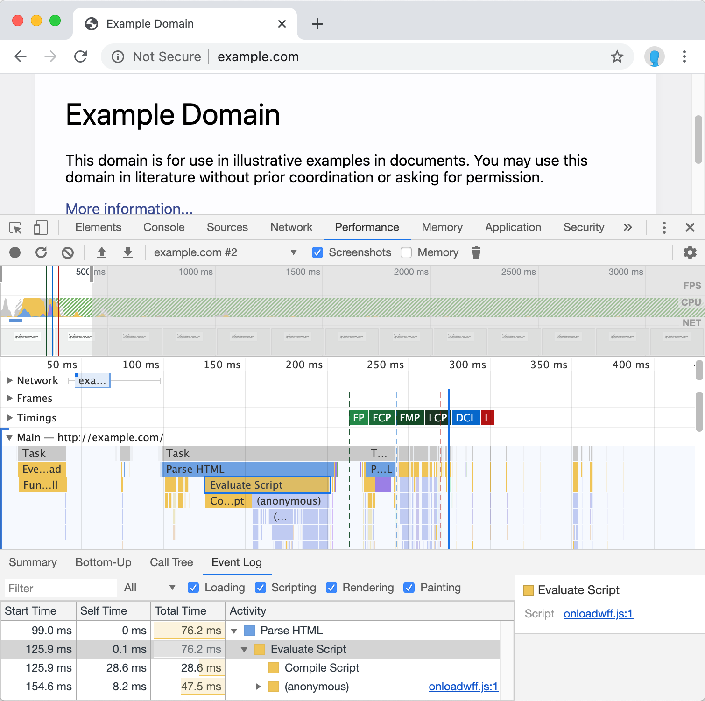
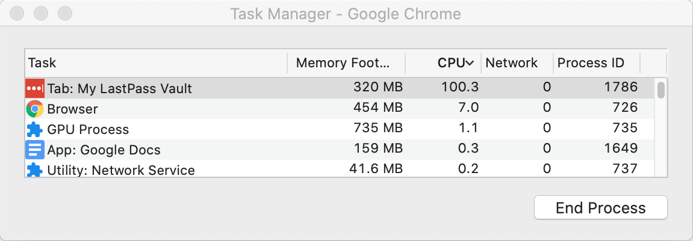
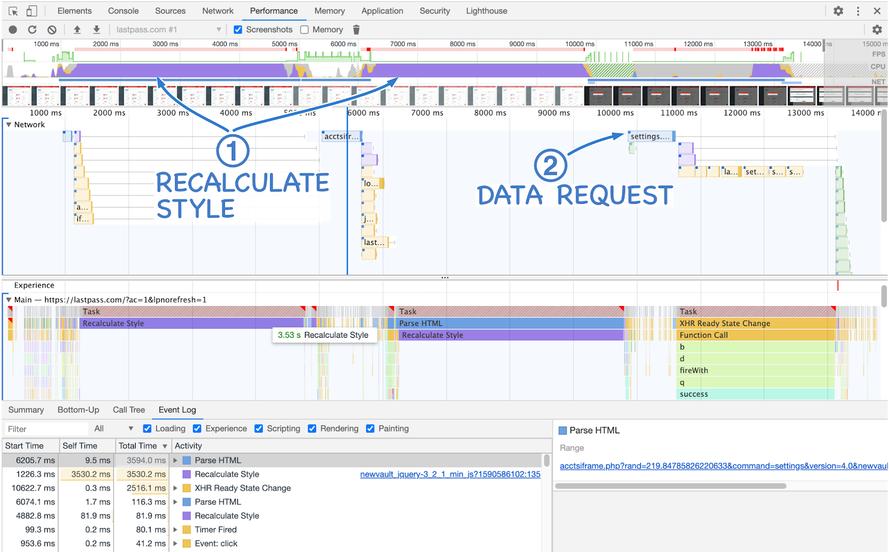
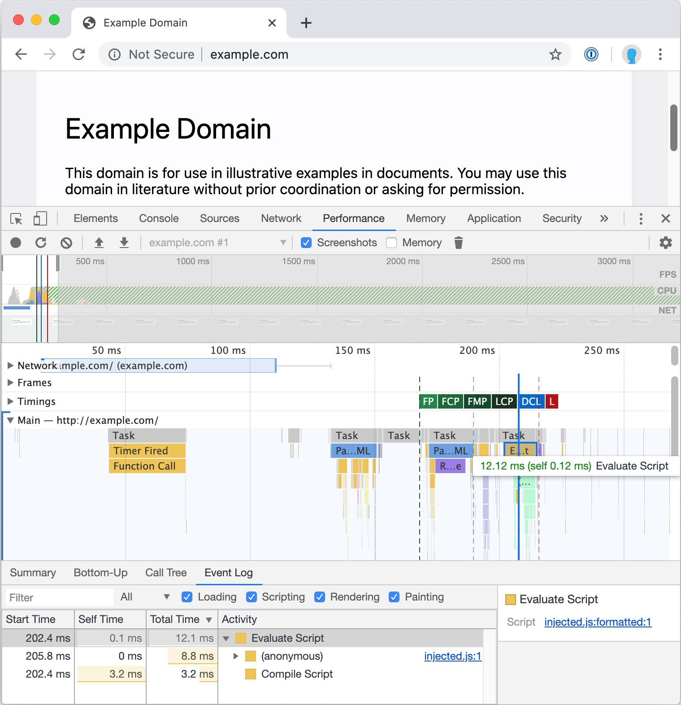

+++
slug = "passing-lastpass"
date = 2020-06-16
visibility = "published"
+++

# Passing on Lastpass: migrating to 1Password

After implicating [Lastpass] as a culprit in browser slowness, I ripped it out 
and replaced it with the significantly snappier [1Password]. Lasspass slows down
the browser in a litany of ways:

[Lastpass]: https://www.lastpass.com/
[1Password]: https://1password.com/

- Chrome compiles the Lastpass JavaScript bundle on every page load. Crucially, 
  Lastpass injects the script so that Chrome blocks the [first contentful 
  paint]. Lastpass takes 70ms to compile on a relatively high-end MacBook pro. 
  This means Lastpass adds a 70ms delay to all page loads.

[first contentful paint]: https://web.dev/fcp/

- The Lastpass vault is hilariously slow. Opening up account properties in the 
  Lastpass vault pegs the CPU at 100% for 15 seconds.

- On a more subjective note, interacting with the vault and form-filling with 
  Lastpass feels much more janky than 1Password.
  
The migration to 1Password was surprisingly straightforward. The 1Password 
documentation breaks down into two [easy steps] with nine total subtasks. I 
completely migrated to 1Password in less than 10 minutes.

[easy steps]: https://support.1password.com/import-lastpass/

## Lastpass performance

Let’s examine Lastpass performance on a simple page, example.com, to evaluate 
the performance impact of the extension.

CAPTION: The performance timeline of loading example.com with Lastpass. Notice
that the "Evaluate Script" for Lastpass blocks the first contentful paint (FCP).
Onloadwff.js is part of the Lastpass extension.

CONTINUE_READING

Additionally, using the Lastpass vault fails to spark joy. Simple tasks, like 
opening the account options, pegged the CPU at 100% usage for about 15 seconds.

CAPTION: The Lastpass vault CPU usage after opening account properties.

CAPTION: The timeline of opening Lastpass account properties. Lastpass spends an 
inexplicable 7 seconds recalculating styles and takes 10 seconds before starting
to render the account dialog.

## 1Password performance

In contrast, 1Password loads its JavaScript bundles after the first contentful 
paint (FCP) and avoids blocking page rendering. Additionally, 1Passwords’s 
JavaScript bundle is much more lean; Chrome compiles 1Password in 12 ms to load 
compared to Lastpass’ 76ms.

CAPTION: The performance timeline of loading example.com with 1Password. Notice 
that the “Evaluate Script” occurs after the first contentful paint (FCP). 
injected.js is part of the 1Password extension.

::: preview https://web.dev/fcp/
First Contentful Paint (FCP)

First Contentful Paint (FCP) is an important, user-centric metric for measuring 
perceived load speed because it marks the first point in the page load timeline
where the user can see anything on the screen—a fast FCP helps reassure the user
that something is happening.

The First Contentful Paint (FCP) metric measures the time from when the page 
starts loading to when any part of the page's content is rendered on the screen.
For this metric, "content" refers to text, images (including background images),
`<svg>` elements, or non-white `<canvas>` elements.
:::

