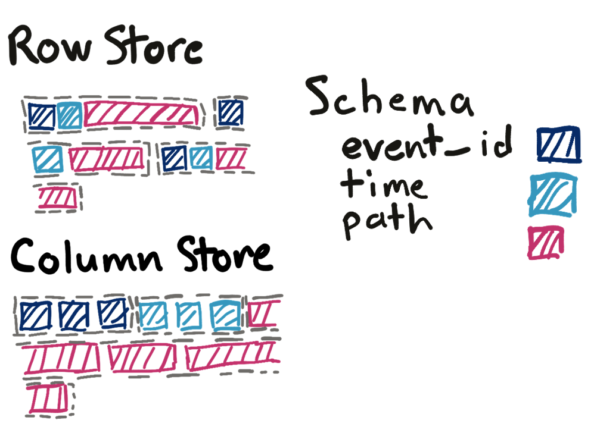
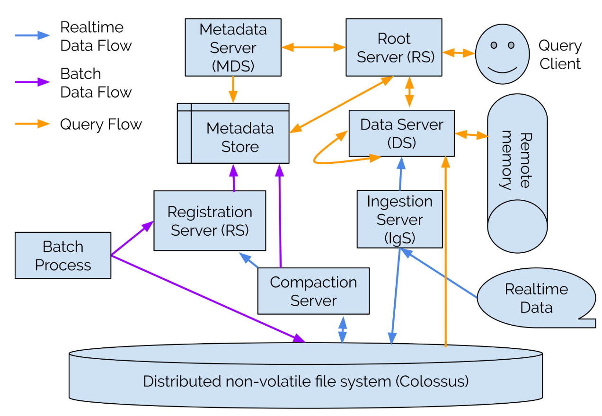
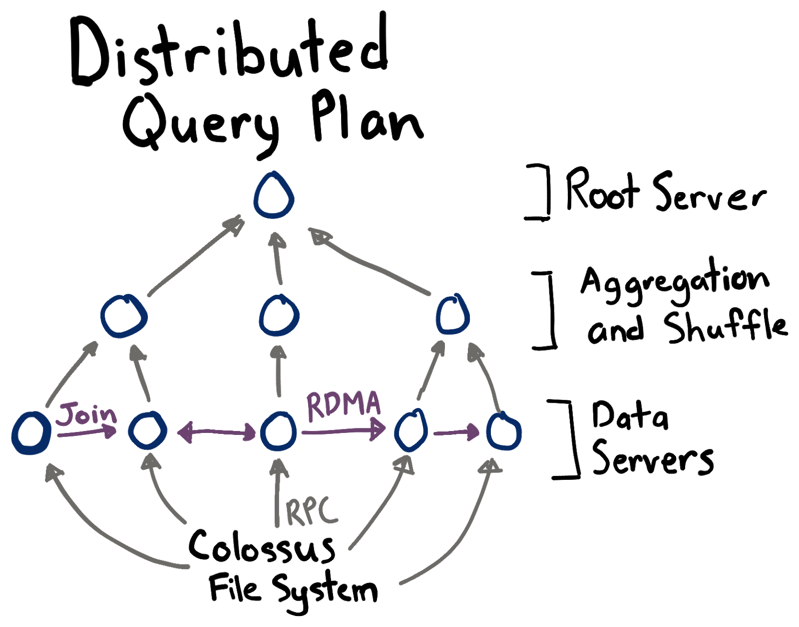

+++
slug = "procella-youtube-analytical-database"
date = 2020-06-21
visibility = "published"
bib_paths = ["/ref.bib"]
+++

# Procella - YouTube’s analytical column store

:toc:

Procella is a horizontally scalable, eventually consistent, distributed column
store leveraging lambda architecture to support both realtime and batch queries
[^@chattopadhyay2019procella]. Let’s define those terms one at a time:

- Horizontally scalable means YouTube can spin up more machines and Procella
  will distribute queries to the new machines automagically.
- Procella doesn't support strong database [isolation] levels (the I in ACID). Queries
  support [read uncommitted] isolation which can cause _dirty reads_. A dirty
  read occurs when a transaction sees uncommitted changes from another
  transaction.
- The lambda architecture means there are two write paths. The first path, called the
  real-time write path, aims for low latency and writes into an unoptimized
  row-store that’s immediately available for queries. The second, called the
  batch write path, ingests large quantities of data into an optimized columnar
  format. The query path merges changes from both real-time and batch storage to
  unify results.
- Distributed means the data is sharded across multiple servers.
- A column store refers to how the database physically stores data. See the
  figure below for how we might store a table with three columns: `event_id`, 
  `time`, and `path`.
  


CAPTION: The difference in data layout between a row store and a column store.

[isolation]: https://en.wikipedia.org/wiki/Isolation_(database_systems)
[read uncommitted]:
  https://en.wikipedia.org/wiki/Isolation_(database_systems)#Read_uncommitted

CONTINUE_READING

We need a bit more room to explain row stores and column stores. A row store
writes data for a single record contiguously. If we’re storing events with three
columns
`event_id`, `time`, and `path`, a row store writes 1 `event_id`, then 1
`time`, then 1 `path`. Then the row store repeats the process for each row.

A column store writes a single column for many rows contiguously. If we had 5
events, we’d first write five `event_ids`, then 5 `times`, then 5 `paths`. The
benefits of a column store are better compression (usually about 10x better) and
better locality since all the values for a single column are adjacent. The
primary disadvantage is you can’t easily update column stores; you have to
rewrite the entire file.

## Procella architecture

Procella runs on Google infrastructure which has two important consequences.
First, storage is completely separate from compute. There are no local disks
inside Google. There are only remote procedure calls (RPC). Instead of reading
or writing to disk, every read or write is an RPC. Second, binaries run on
multi-tenant servers, so a noisy-neighbor can really wreck your day regarding
performance. We’ll revisit these points in the optimizations section.

The architecture for Procella is a lambda architecture with two write data flows
(realtime and batch), and a single query flow.



CAPTION: The Procella system architecture showing the 3 main flows.

The first write path is the batch data flow (in purple). A user creates a file
in a supported format (typically through a batch job like an hourly map reduce
job). The user sends the file path to the Procella registration server. The
registration server checks that the file header matches the SQL schema for the
user’s schema. After validation, the file is available for querying.
Importantly, Procella doesn't process the file or scan the data other than
sanity checking that the schema matches. This approach is a radical departure
from most existing row stores. For example, when we write an event into Citus,
we create an index on every event definition for that environment.

The second write path is real-time data flow (in blue). Realtime data comes from
RPCs or PubSub (similar to Kafka topics). The ingestion server appends the data
to a write-ahead log (WAL) and stores the data in memory for querying realtime
data. The real-time data flows makes data available for querying in about 1
second. Later, a compaction job will compact the WAL into an optimized columnar
format. The compaction job supports user defined transformations including
filtering data, aggregating data, and expiring old data. This is a really cool
feature. User defined transformations means you can do things like normalize
email addresses to all lowercase. The transformations give you a convenient fix
for customer-specific customizations.

The query path begins at the root server (in orange). The root server does all
the heavy lifting for preparing the query including parsing, query rewrites,
planning, plan selection, and plan optimization. The root server then fetches
the location of data files from the metadata server. A metadata server is
similar to a catalog table which holds the location of all files that make up a
table. Oftentimes, the root server can prune files by using zone maps for the
file. A zone map is lightweight metadata describing all data in the file. A zone
map for a file containing events would include the earliest and latest event
time, and the min/max user ID. For example, if a file’s last event time is
2020-01-19, we don’t need to search the file if the query has a predicate like
`WHERE event_time > '2020-02-01'`.

The output of the root server is a physical plan tree. Using trees to distribute
large queries to many servers is similar to the approach described in the
[Dremel (BigQuery) paper][dremel] [^@melnik2010dremel]. A tree is necessary because the intermediate
data for large queries might exceed the resources for a single server. The root
server partitions the physical query plan into sub-plans and distributes the
sub-plans. Each data server fetches and transforms the data according to the
sub-plan.

[dremel]:
  https://static.googleusercontent.com/media/research.google.com/en//pubs/archive/36632.pdf



CAPTION: A distributed query plan in Procella.

The data servers can communicate among each-other with either RPC or with remote
direct memory access (RDMA). After a data server finishes, it sends the results
to a parent server for aggregation.

## Query evaluation

The advantage of a column store for large analytical queries is a combination of
four attributes as described by Abadi (think the Knuth of column stores) in
[The Design and Implementation of Modern Column-Oriented Database Systems][abadi_col] [^@abadi2013design].

[abadi_col]: /papers/abadi2013design.pdf

- Vectorized execution: apply functions on an array of values from a single
  column. In contrast, a row store processes 1 row at time and extracts the
  column from each row.
- Operation on compressed data: Instead of decompressing data, operate directly
  on it by using knowledge of the compression scheme. Don’t think GZIP here,
  think run-length encoding where we can represent the array
  `[3, 3, 3, 3, 8, 8]` as `[(3, 4), (8, 2)]`. With run-length encoding,
  calculating the count is `4 + 2 = 6`.
- Late materialization: the query engine keeps intermediate data in a column
  format for as long as possible to dramatically speed up aggregations.
  Materialization means converting columns into rows.
- Database cracking: create indexes just-in-time. The database incrementally
  sorts columns as a side effect of query processing, e.g. `ORDER BY time`. With
  database cracking, we keep the intermediate sorted results for use in
  following queries. In contrast, row stores require creating indexes ahead of
  time. Since query patterns change over time, the indexes might not get used.
  Database cracking ensures indexes are always up to date and match query
  patterns precisely.

### Operation on compressed data

Procella leverages adaptive encoding (aka lightweight compression) which is a
fancy way of saying it tries a bunch of different encodings and picks the best
one. For example, you can use any of the following encodings for an array of
integers. Consider the array [3, 4, 4, 4, 0, 0, 9]. Here’s what different
encoding would produce.

- Run length encoding: `[(3, 1), (4, 3), (0, 2), (9, 1)]`
- Delta encoding (the difference from the previous value):
  `[3, 1, 0, 0, -4, 0, 9]`
- Frame of reference (the difference from the initial value):
  `[3, 1, 1, 1, -4, -4, 6]`

For an array of strings, consider `[foo, bar, baz, baz, bar, qux]`. Dictionary
encoding creates a mapping from a string to an
integer:`{foo: 0, bar: 1, baz: 2, qux: 3} => [0, 1, 2, 2, 3, 1]`. There are all
sorts of clever variations on dictionary encoding. Some of my favorites are
using prefix compression on the dictionary itself and using a two-level
dictionary where each column has its own dictionary and all strings are stored
in a global dictionary.

### Inverted indexes for experiment IDs

Procella relies on database cracking instead of pre-declared indexes. However,
Procella supports a single secondary index for arrays of numbers. The use case
is to track the results of experiments. Each experiment is represented with an
integer ID. A row might have several experiments associated with it, like
`{row_id: 43, experiments: [543, 778, 901]}`. For a query like:

```sql
SELECT count(*) FROM events WHERE 543 IN experiments
```

Procella must check the experiments array of each row. As an optimization,
Procella adds an [inverted index](https://en.wikipedia.org/wiki/Inverted_index)
from an experiment ID to all the rows that contain that experiment. For the
example above, the index might look like: `{543: [43], 778: [43], 901: [43]}`.
With this index, we can go to the key 543 and search only those rows. This
optimization yielded a 500x speed-up in queries that contained an experiment
filter clause.

## Optimizations

### Caching

The metadata servers, which contain the mapping of SQL tables to the data files
that hold the data, caches the locations of all data files with a 99% hit rate.
The paper was unclear, but I’m pretty sure the metadata server uses a three
level cache. The source of truth is Spanner, a strongly consistent row store
similar to Postgres but magically scalable and expensive. Spanner has a P99
latency of about 500ms. The second level of cache is Bigtable, a key-value
store, which has P99 of about 50ms. The final cache is in-memory cache on the
server with a latency of about 100ns.

The data servers, which fetch and process data files, cache the data files with
a least-recently used scheme to attain a 90% hit rate. Impressively, only 2% of
the total data in Procella is stored in memory at any one time. The reason the
cache hit rate is high is due to affinity scheduling. Affinity scheduling means
the root server will consistently route requests for a file to the same server,
improving the hit rate. Notably, the affinity scheduling is loose. If a data
server crashes or slows down due to a noisy neighbor, the root server will route
the request to a new data server.

Procella optimizes queries with data from running queries instead of maintaining
statistics for existing data. Specifically, the root server runs the query on a
subset of data to estimate the cardinality and cost of the plan.

### Joins

Procella supports a number of join algorithms and chooses at query time
depending on the number of unique values and sort order. Procella implements
joins by transferring information between two data servers or up to a parent
server that coordinates the join.

- Broadcast join. If one side of a join has fewer than 100k records, the data
  server sends all records to other machines doing the join.
- Pre-shuffled. If one side of a join is already partitioned on the join key,
  have the other side of the join partition itself to match the first side.
- Full-shuffle. If no other join optimization is available, first calculate the
  number of shards by querying a subset of results. Then each data server sends
  data to the appropriate server to be joined with the other side.

### Tail latency mitigation

Okay, remember from up top where I said all reads and writes are really RPCs?
This is bad because RPCs are slow, unreliable, and can have exceedingly high
tail latency, especially if you send a few thousand at a time. Put simply, if
Procella sends out 1000 RPCs, one of those RPCs is likely to be as slow as the
99.9<sup>th</sup> percentile latency which might be 1-2 orders of magnitude
slower than the 50<sup>th</sup> percentile latency. For more detail on tail
latency, I highly recommend
[The Tail at Scale](https://research.google/pubs/pub40801/). Procella uses four
techniques to reduce tail latency:

1. Query hedging. To implement query hedging, track the latency of servers in
   groups of 10 (0-9%, 10-19%, …, 90-100%) ordered by the latency to that server
   (aka quantiles). If an in-flight query takes longer than the latency of the
   70% group, resend the query to a different server. Use whichever query comes
   back first and discard the slower query.
2. The root server rate limits incoming queries to avoid overwhelming data
   servers.
3. The root server attaches a priority to each request. Servers maintain
   separate thread pools for high and low priorities. This ensures intermediate 
   servers serve high priority queries quickly without waiting to process a 
   queue of low priority queries like batch queries.
4. The root server adds intermediate servers to the physical plan tree to help
   aggregate results if the leaf nodes return many records.

::: preview https://en.wikipedia.org/wiki/Isolation_(database_systems)
Isolation (database systems)

In database systems, isolation determines how transaction integrity is visible
to other users and systems. For example, when a user is creating a Purchase
Order and has created the header, but not the Purchase Order lines, is the
header available for other systems/users (carrying out concurrent operations,
such as a report on Purchase Orders) to see? (Refers to current, not past
database systems)

A lower isolation level increases the ability of many users to access the same
data at the same time, but increases the number of concurrency effects (such as
dirty reads or lost updates) users might encounter. Conversely, a higher
isolation level reduces the types of concurrency effects that users may
encounter, but requires more system resources and increases the chances that one
transaction will block another.

Isolation is one of the ACID (Atomicity, Consistency, Isolation, Durability)
properties.
:::

::: preview https://en.wikipedia.org/wiki/Isolation_(database_systems)#Read_uncommitted
Database isolation - read uncommitted

This is the lowest isolation level. In this level, dirty reads are allowed, so
one transaction may see not-yet-committed changes made by other transactions. A
dirty read (aka uncommitted dependency) occurs when a transaction is allowed to
read data from a row that has been modified by another running transaction and
not yet committed.
:::

::: preview https://static.googleusercontent.com/media/research.google.com/en//pubs/archive/36632.pdf
Dremel: Interactive Analysis of Web-Scale Datasets

Dremel is a scalable, interactive ad-hoc query system for analysis of read-only
nested data. By combining multi-level execution trees and columnar data layout,
it is capable of running aggregation queries over trillion-row tables in
seconds. The system scales to thousands of CPUs and petabytes of data, and has
thousands of users at Google. In this paper, we describe the architecture and
implementation of Dremel, and explain how it complements MapReduce-based
computing. We present a novel columnar storage representation for nested records
and discuss experiments on few-thousand node instances of the system.
:::

::: preview https://en.wikipedia.org/wiki/Inverted_index
Inverted index

In computer science, an inverted index (also referred to as a postings file or
inverted file) is a database index storing a mapping from content, such as words
or numbers, to its locations in a table, or in a document or a set of documents
(named in contrast to a forward index, which maps from documents to content).
The purpose of an inverted index is to allow fast full-text searches, at a cost
of increased processing when a document is added to the database. The inverted
file may be the database file itself, rather than its index. It is the most
popular data structure used in document retrieval systems, used on a large
scale for example in search engines.

There are two main variants of inverted indexes: A record-level inverted index
(or inverted file index or just inverted file) contains a list of references to
documents for each word. A word-level inverted index (or full inverted index or
inverted list) additionally contains the positions of each word within a
document. The latter form offers more functionality (like phrase searches), but
needs more processing power and space to be created.
:::

::: preview https://research.google/pubs/pub40801/
The Tail at Scale

Systems that respond to user actions very quickly (within 100 milliseconds) feel
more fluid and natural to users than those that take longer. Improvements in
Internet connectivity and the rise of warehouse-scale computing systems have
enabled Web services that provide fluid responsiveness while consulting
multi-terabyte datasets that span thousands of servers. For example, the Google
search system now updates query results interactively as the user types,
predicting the most likely query based on the prefix typed so far, performing
the search, and showing the results within a few tens of milliseconds. Emerging
augmented reality devices such as the Google Glass prototype will need
associated Web services with even greater computational needs while guaranteeing
seamless interactivity.

It is challenging to keep the tail of the latency distribution low for
interactive services as the size and complexity of the system scales up or as
overall utilization increases. Temporary high latency episodes which are
unimportant in moderate size systems may come to dominate overall service
performance at large scale. Just as fault-tolerant computing aims to create a
reliable whole out of less reliable parts, we suggest that large online services
need to create a predictably responsive whole out of less predictable parts. We
refer to such systems as latency tail-tolerant, or tail-tolerant for brevity.
This article outlines some of the common causes of high latency episodes in
large online services and describes techniques that reduce their severity or
mitigate their impact in whole system performance. In many cases, tail-tolerant
techniques can take advantage of resources already deployed to achieve
fault-tolerance, resulting in low additional overheads. We show that these
techniques allow system utilization to be driven higher without lengthening the
latency tail, avoiding wasteful over-provisioning.
:::

::: preview /papers/abadi2013design.pdf
The Design and Implementation of Modern Column-Oriented Database Systems

In this article, we survey recent research on column-oriented database systems,
or column-stores, where each attribute of a table is stored in a separate file
or region on storage. Such databases have seen a resurgence in recent years with
a rise in interest in analytic queries that perform scans and aggregates over
large portions of a few columns of a table. The main advantage of a column-store
is that it can access just the columns needed to answer such queries. We
specifically focus on three influential research prototypes, MonetDB,
MonetDB/X100, and C-Store. These systems have formed the basis for
several well-known commercial column-store implementations. We describe their
similarities and differences and discuss their specific architectural features
for compression, late materialization, join processing, vectorization and
adaptive indexing (database cracking).
:::

