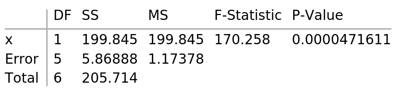
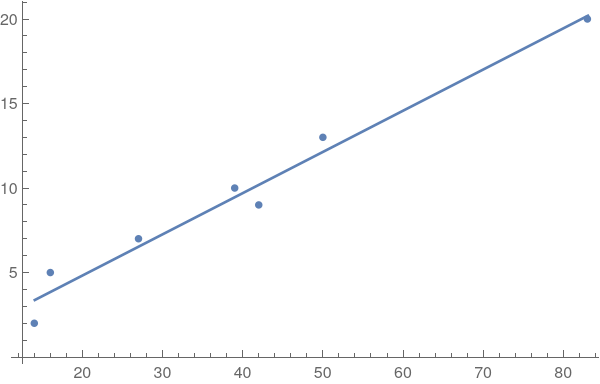

+++
slug = "mathematica-simple-linear-regression"
date = 2020-10-09
visibility = "published"
+++

# Simple linear regression in Mathematica

I'm working my way, slowly, through *The Art of Computer Systems Performance 
Analysis*. I've reached the chapter on simple linear regression. Here's how to
do simple linear regression in Mathematica.

We'll start by defining our data:

```mathematica
data = {
  {14, 2}, {16, 5}, {27, 7}, {42, 9}, {39, 10}, {50, 13}, {83, 20}
}
```

We'll create a linear model and show an ANOVA table.

```mathematica
model = LinearModelFit[data, x, x]
model["ANOVATable"]
```



CAPTION: Mathematica ANOVA table

`SS` is the sum of squares, the sum of the squared deviations from the expected 
value.

-`SS` for x is the sum of squares due to regression (SSR).
-`SS` for error is the sum of squares due to error (SSE). 
-`SS` for total is the total sum of squares (SST). 

`MS` is mean square, the sum of squares divided by the degrees of freedom.

- `MS` for x is also SSR because the degrees of freedom for x is 1.
- `MS` for error is the mean squared error $MSE = SSE / DegreesFreedom$.

The F-statistic is the mean square of x divided by the mean squared error.

Let's plot the data points and regression line:

```mathematica
Show[
  ListPlot[data141],
  Plot[{line}, {x, Min[First /@ data], Max[First /@ data]}]
]
```



CAPTION: Plot of the data points and regression line.


To get values programmatically:

- $\bar x$ the sample mean of x:
 `Mean[First /@ data]`

- $\bar y$ the sample mean of dependent variable:
 `Mean[model["Response"]]`

- SSY, the sum of squares of the observed, dependent variables:
 `ssy = Total[#^2 & /@ model["Response"]]`

- SS0, the sum of squares of the sample mean of the dependent variable:
 `ss0 = Length[data]*Mean[model["Response"]]^2`

- SSR, the sum of squares due to regression:
 `ssr = model["SequentialSumOfSquares"][[1]]`

- $R^2$, the coefficient of determination:
 `r2 = model["RSquared"]`

- $b_0$ and $b_1$, the parameters of the regression:
 `{b0, b1} = model["BestFitParameters"]`

- $t_[1-\alpha/2;n-1]$, the quantile of a student-t variate at a given 
  significance level $\alpha = 0.1$ and 6 degrees of freedom:
  `t95 = Quantile[StudentTDistribution[6], 0.95]`