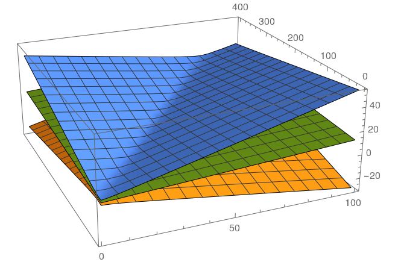

+++
slug = "mathematica-multiple-linear-regression"
date = 2020-10-18
visibility = "published"
+++

# Multiple linear regression in Mathematica

Continuing my slow journey through *The Art of Computer Systems Performance Analysis*,
I've reached chapter 15, "Other Regression Models". I'll cover the first part
of the chapter on multiple linear regression models. The definition of multiple linear regression from the textbook:

> A multiple linear regression model allows one to predict a response variable $y$ as a function of $k$ predictor
> variables $x_1,x_2,\ldots,x_k$ using a linear model of the following form:

$$ y = b_0 +b_1 x_1 + b_2 x_2 + \cdots + b_k x_k + e $$

> Given a sample $(x_{11}, x_{21}, \ldots, x_{k1}, y_1),\ldots,(x_{1n},x_{2n},\ldots,x_{kn},y_n)$ of $n$ observations,
> the model consists of the following $n$ equations:

$$
\begin{aligned}
y_1 &= b_0 +b_1 x_{11} + b_2 x_{21} + \cdots + b_k x_{k1} + e_1 \\
y_2 &= b_0 +b_1 x_{12} + b_2 x_{22} + \cdots + b_k x_{k2} + e_2 \\
    &\vdots \\
y_n &= b_0 +b_1 x_{1n} + b_n x_{2n} + \cdots + b_k x_{kn} + e_n \\
\end{aligned}
$$

> In vector notation, we have:

$$
\begin{bmatrix}
   y_1 \\
   y_2 \\
   \cdot \\
   \cdot \\
   \cdot \\
   y_n \\
\end{bmatrix} = 
\begin{bmatrix}
   1 & x_{11} & x_{21}  & \cdots  & x_{k1} \\
   1 & x_{12} & x_{22}  & \cdots  & x_{k2} \\
   \cdot & \cdot & \cdot & \cdot  & \cdot  \\
   \cdot & \cdot & \cdot & \cdot  & \cdot  \\
   \cdot & \cdot & \cdot & \cdot  & \cdot  \\
   1 & x_{1n} & x_{2n}  & \cdots  & x_{kn} \\
\end{bmatrix} 
\begin{bmatrix}
   b_0 \\
   b_1 \\
   \cdot \\
   \cdot \\
   \cdot \\
   b_k \\
\end{bmatrix} +
\begin{bmatrix}
   e_1 \\
   e_2 \\
   \cdot \\
   \cdot \\
   \cdot \\
   e_n \\
\end{bmatrix}
$$

> or

$$ \mathbf{y = Xb + e} $$


Box 15.1 contains the formulas relevant to multiple linear regression:

1. Model: $y_i = b_0 +b_1x_{1i} + b_2 x_{2i} + \cdots + b_k x_{ki} + e_i$ or in matrix notation $\mathbf{y = Xb + e}$
   where:
   - $b$ is a column vector with $k+1$ elements $b = \{b_0,b_1,\ldots,b_k\}$
   - $y$ is a column vector of $n$ observed values of $y = \{y_1,y_2,\ldots,y_n\}$
   - $X$ is an $n$ row by $k+1$ column matrix whose $(i,j+1)$th element $X_{i,j+1}=1$ if $j=0$ else $x_{ij}$ 
2. Parameter estimation: $\mathbf{b = (X^TX)^{-1}(X^Ty)}$
3. Allocation of variation:
   - $SSY = \sum_{i=1}^n y^2_i$
   - $SS0 = n \bar y^2$
   - $SST = SST - SS0$
   - $SSE = \{\mathbf{y^Ty - b^TX^Ty}\}$
   - $SSR = SST - SSE$
4. Coefficient of determination: $R^2 = \frac{SSR}{SST} = \frac{SST - SSE}{SST}$
5. Coefficient of multiple correlation $R = \sqrt{\frac{SSR}{SST}}$
6. Degrees of freedom:

   $$
   \begin{aligned}
   SST &= SSY &- &SS0  &= &SSR  &+  &\;SSE \\
   n-1 &= n   &- &\; 1 &= &\; k &+  &\;(n - k - 1) \\
   \end{aligned}
   $$
   
7. Analysis of variance (ANOVA): $MSR=\frac{SSR}{k}$; $MSE=\frac{SSE}{n-k-1}$

   Regression is significant if $MSR/MSE$ is greater than $F_{[1-\alpha;k;n-k-1]}$.
8. Standard deviation of errors: $s_e = \sqrt{MSE}$.
9. Standard error of regression parameters: $s_{b_j} = s_e \sqrt{C_{jj}}$ where $C_{jj}$ 
   is the $j^{th}$ diagonal term of $\mathbf{C = (X^TX)^{-1}}$
10. Prediction: Mean of $m$ future observations:

    $\hat{y}_p = b_0 + b_1 x_1 +b_2 x_{2p} + \cdots + b_k x_{kp}$
    
    Or in vector notation: $\hat{y}_p = \mathbf{x}^T_p\mathbf{b}$; here 
    $\mathbf{x}^T_p = (1,x_{1p},x_{2p},\ldots,x_{kp})$
    
11. Standard deviation of predictions: 
    $s_{\hat y_p} = s_e \sqrt{ \frac{1}{m} + \mathbf{x}^T_p(\mathbf{X}^T\mathbf{X})^{-1}\mathbf{x}_p}$

12. All confidence intervals are computed using $t{[1-\alpha/2;n-k-1]}$.

13. Correlation among predictions:

    $$
    R_{x_1,x_2} = \frac{\sum x_{1i} x_{2i} - n \bar{x_1} \bar{x_2} }
                  {[ \sum x^2_{1i} - n \bar{x}^2_1 ]^{1/2} [\sum x^2_{2i} - n \bar{x}^2_2]^{1/2}}
    $$
    
 14. Model assumptions
 
     - Errors are independent and identically distributed normal variations with zero mean.
     - Errors have the same variance for all values of the predictors.
     - Errors are additive.
     - $x_i$'s and $y$ are linearly related.
     - $x_i$'s are nonstochastic (i.e not random) and are measured without error.
     
 15. Visual tests:
 
     - Scatter plot of errors versus predicted response should not have any trend.
     - The normal quantile-quantile plot of errors should be linear.
     
## Mathematica commands     
     
Define our data. Each tuple in the list has form $(x_1, x_2, y)$:

```mathematica
data = {
  {14, 70, 2},
  {16, 75, 5},
  {27, 144, 7},
  {42, 190, 9},
  {39, 210, 10},
  {50, 235, 13},
  {83, 400, 20}
}
```     

Create a linear model:

```mathematica
lm = LinearModelFit[data, {x1, x2}, {x1, x2}]
```

- ANOVA table:

   ```mathematica
    lm["ANOVATable"]
   ```

- Mean of response variable, $\bar y$:

   ```mathematica
    N[Mean[lm["Response"]]] == 9.42857
   ```

- SSR, sum of squares due to regression:

   ```mathematica
    lm["SequentialSumOfSquares"] == {199.845, 0.568796}
   ```

- Coefficient of determination $R^2$:

   ```mathematica
    lm["RSquard"] == 0.974236
   ```

- The predicted response variables for each sample, $\hat y_i$:

   ```mathematica
    lm["PredictedResponse"] == {3.3, 3.7, 6.8, 9.8, 10.0, 11.9, 20.2}
   ```

- The residual (error) for each data point in the sample, $e_i$:

   ```mathematica
    lm["FitResiduals"] == {-1.3, 1.2, 0.15, -0.84, -0.015, 1.02, -0.25}
   ```

- Regression parameters $\{b_0, b_1, \ldots, b_k\}$:

   ```mathematica
    lm["BestFitParameters"] == {-0.161, 0.118, 0.0265}
   ```

- The standard error of the regression parameters:

   ```mathematica
    lm["ParameterErrors"] == {0.91, 0.19, 0.040}
   ```

- $b_0 \mp ts_{b_0}$ and $b_1 \mp ts_{b_1}$, the confidence intervals for 
  regression parameters:
  
  ```mathematica
  (* Default confidence interval is 0.95. *)
  lm = LinearModelFit[data, {x1, x2}, {x1, x2}, ConfidenceLevel -> 0.95]
  lm["ParameterConfidenceIntervals"]
  (* {{-2.69759, 2.37469}, {-0.416515, 0.652989}, {-0.0858019, 0.138805}} *)
  ```
  
- Prediction for observations at 90% confidence level for both many observations 
  and a single observation.
  
  ```mathematica
  lm = LinearModelFit[data, {x1, x2}, {x1, x2}, ConfidenceLevel -> 0.9]
  (* for many observations *)
  lm["MeanPredictionBands"] /. {x1 -> 100, x2 -> 550}
  (* {19.5571, 32.919} *)
  
  (* for a single observation *)
  lm["SinglePredictionBands"] /. {x1 -> 100, x2 -> 550}
  (* {19.1207, 33.3554} *)
  ```

- Mean square values for all regression parameters and the error: 

  ```mathematica
  lm["ANOVATableMeanSquares"] == {199.845, 0.568796, 1.325}
  ```
  
- Plot the mean regression response with the confidence intervals:

  ```mathematica
  planes = Append[lm["MeanPredictionBands"], lm["BestFit"]];
  Plot3D[planes, {x1, 1, 20}, {x2, 1, 1000}]
  ```
  
  
  
  CAPTION: Regression prediction graph with 95% confidence interval graphs.
  
- The correlation matrix, showing $R_{x_ix_j}$ for every pair of $(i,j) < k$ 

  ```mathematica
  lm["CorrelationMatrix"] // MatrixForm
   ```